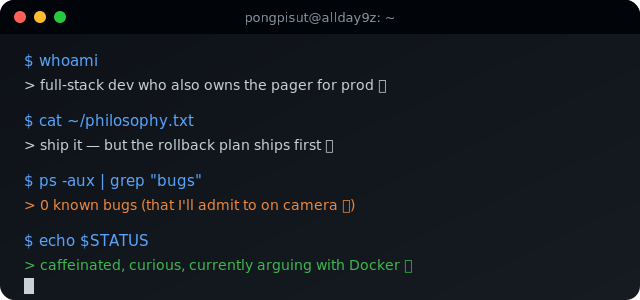
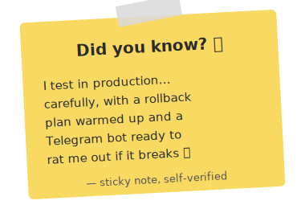

<!--
References used in this README
https://github.com/kyechan99/capsule-render
https://github.com/DenverCoder1/readme-typing-svg
https://skillicons.dev
https://github.com/anuraghazra/github-readme-stats
https://github.com/DenverCoder1/github-readme-streak-stats
https://github.com/Ashutosh00710/github-readme-activity-graph
https://github.com/lowlighter/metrics
Custom hand-drawn SVG cards: assets/cards/*.svg (self-hosted, no third-party uptime risk)
-->

  

  

 

<table>
<tr>
<td width="70%" valign="top">

### &nbsp; A little about me

I'm **Pongpisut M.**, a full-stack developer who accidentally became a systems engineer because someone had to keep the servers alive. I write the feature, ship the feature, then stay up making sure the feature doesn't set anything on fire.

- 🧑‍💻 Full-stack dev by day, infrastructure whisperer by necessity
- 🤖 Currently obsessed with AI-assisted engineering — teaching agents to do the boring parts responsibly
- 🛠️ Comfortable anywhere between a React component and a Proxmox host
- 🇹🇭🇺🇸 Bilingual brain — code comments in English, panic in Thai
- 🎯 Personal rule: nothing gets deleted, everything ships with a rollback plan

</td>
<td width="30%" align="center" valign="top">
  
</td>
</tr>
</table>

  

### 📬 Reach me

  

### 🛠️ What I build with

  

+ the self-hosted stack I run for fun at home 🏡

  

<b>🎯 Click here if you're curious what I'm actually up to right now</b>

 

I spend most days somewhere between shipping product features and hardening the infrastructure they run on — CI/CD pipelines, container orchestration, and enough monitoring that nothing surprises me at 3am (in theory).

Lately I've been leaning hard into **AI-assisted engineering** — using LLM agents as force multipliers for repetitive ops work, code review, and incident triage, while keeping a very firm hand on anything destructive. The rule is simple: agents plan, humans approve, nothing important gets deleted without a backup first.

If you want to talk shop: Laravel/Filament architecture, WooCommerce internals, Docker/Proxmox homelab setups, or why your CI pipeline is lying to you about being green — I'm in.

  

### 📊 The receipts

  

 

  

 

  

  

  

 

  

  

